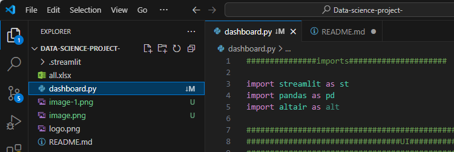
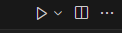
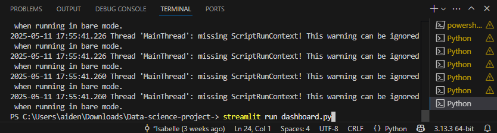
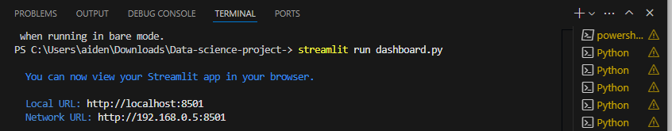
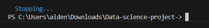

# Data-science-project
group P000151DSUG

computer installations
IDE: visual studio code
https://code.visualstudio.com/

GIT:
https://git-scm.com/

GITHUB: (need to make an account)
https://github.com/

STRREAMLIT: (need to make an account)
https://authkit.streamlit.io/?client_id=project_01EZ8RPVCZQ40ZGBV6Y87N8V8V&redirect_uri=https%3A%2F%2Flogin.streamlit.io%2Fapi%2Fv1%2Flogin%2Fshare%2Fcallback&response_type=code&state=ZeCp1M6p53PseK1vW35J7EZ55cDDMqAcx4K7GsWt170qAvTlswnvhOZ1kZCi-jCaYhrUUU9Jb5aiUVfA7B1JbSvh7fKVrvqCqx-D4Dy49uprhJHHn1ZctyAlRLJnauqs9mpH6BGGSSmtsBYOLHhf-j0us1XjmZpuYBXtBovmRC1h6GJt0JUln78LczuBYV-MQU_a_W9bjri7GvxyRM0aSHvBBc6Oa0_gEWvTNHzR08m9Ek7_dwpPDoUr0L6XuXKDs85I5m7WTqCSs8lW_3D0kUcIPxpN8X2Kr7c41G_OPOVpJDob6UNi0a6jbA1whjg6DJyPiG0JLWk-rcplszW88LVVI3n_a5zbdVYNYJa6Fs3AhigYGSKaQccvzN7pGy55X3Nl2MZJ71X524zeEmJZWXuJGfV8KEMY37-GtKtebw9aoExwRwHnPBex1oxIRE6vVg5GslTVDbJNsJIu3rwoX7JSoLtz-g4WV2-3TU6_&authorization_session_id=01JVGNGGXQ993FW0YQNP5SGZKW

Visual studio code extensions:
to run pyothn we will need these(they should come together under python)
- pylance
- python
- python debugger

videos to help with setup
working with vs(visual studio) code

https://www.youtube.com/watch?v=B-s71n0dHUk&ab_channel=VisualStudioCode

git/ github in vs code

https://www.youtube.com/watch?v=i_23KUAEtUM&t=300s&ab_channel=VisualStudioCode

code operation:
- neccersay installments (copy and paste into terminal, then restart computer)
pip install streamlit
pip install pandas
pip install altair

- to run the code

1,click on dashboard.py

2,click run (triangle top right corner)

3,paste this in terminal: streamlit run dashboard.py

4, press the neter key

5, if i t looks like this it , control click to top link

- to stop the code

go to visual studio codes terminal press: ctrl + c

- to turn the dashboard into a web-link
1,sign into Streamlit Community Cloud (free version) using your GitHub account (press authorise)
2,press the 'Create app' button in the top right hand corner
3,select 'Deploy a public app from GitHub', then 'Deploy now'
4,paste the GitHub url into respository (this is the URL link on the home-page of the repository - ensure that it is on public)
5,adjust the main file path to 'dashboard.py', and set the App URL
6,Press deploy and now it is transformed into a web-based link

link:

