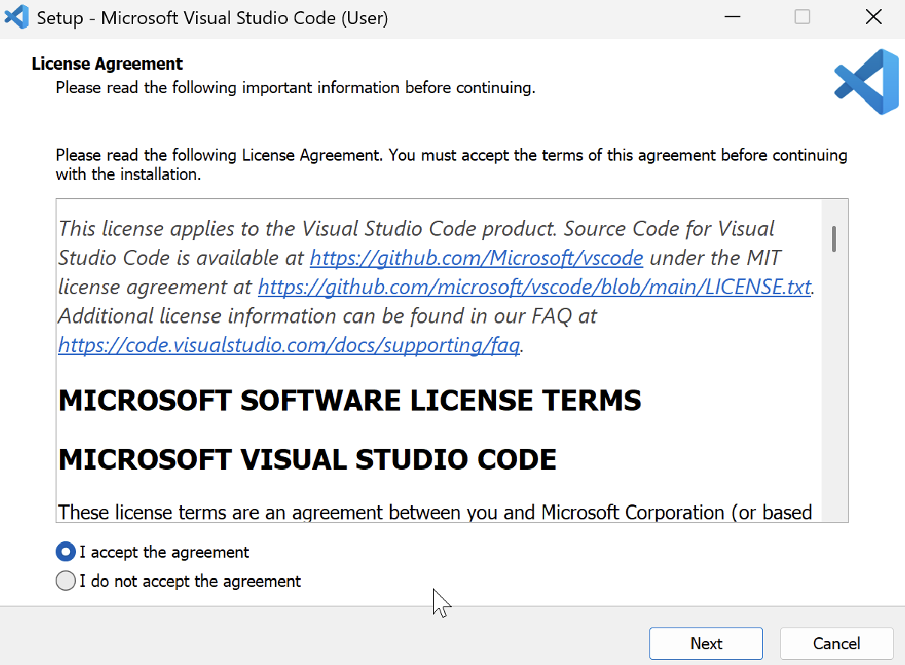
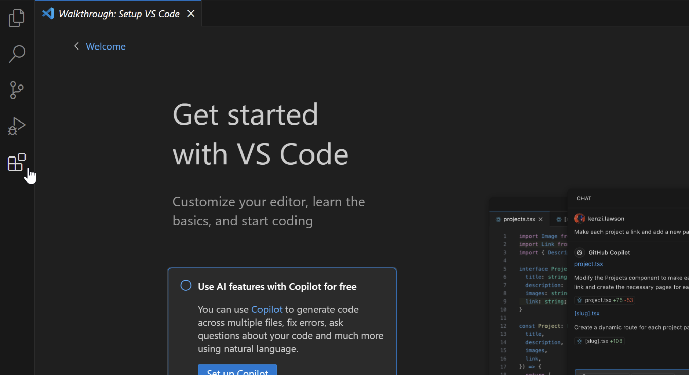
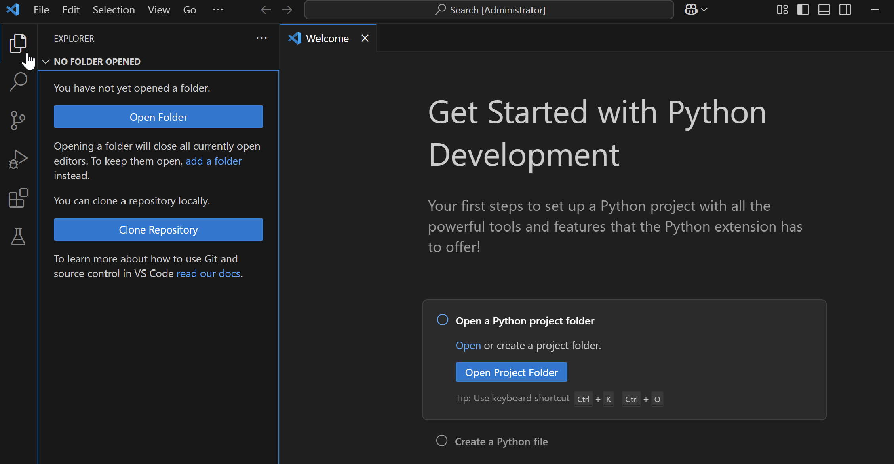
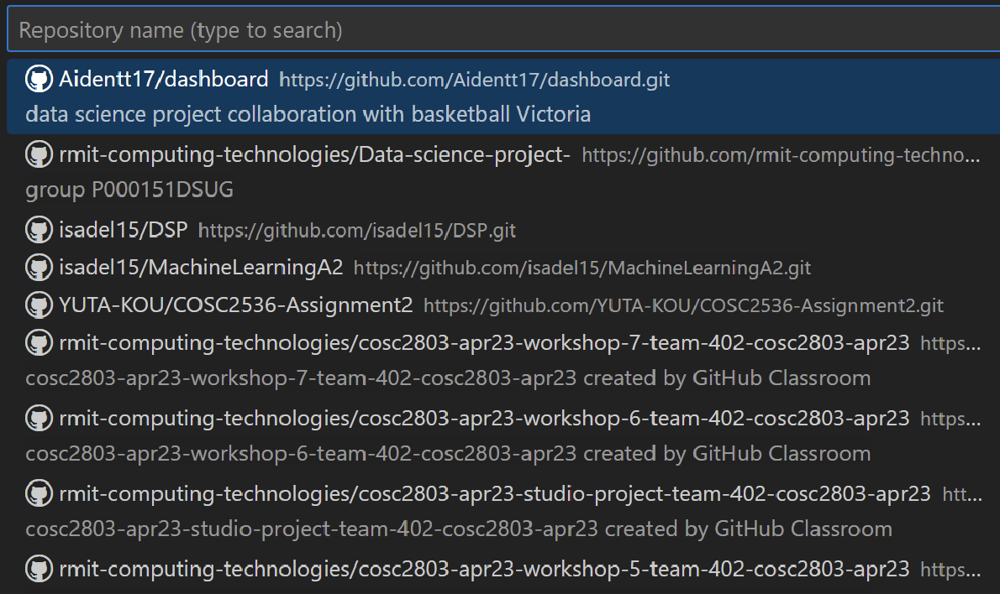
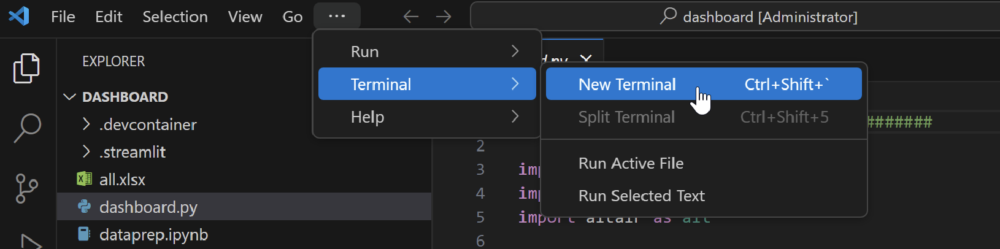
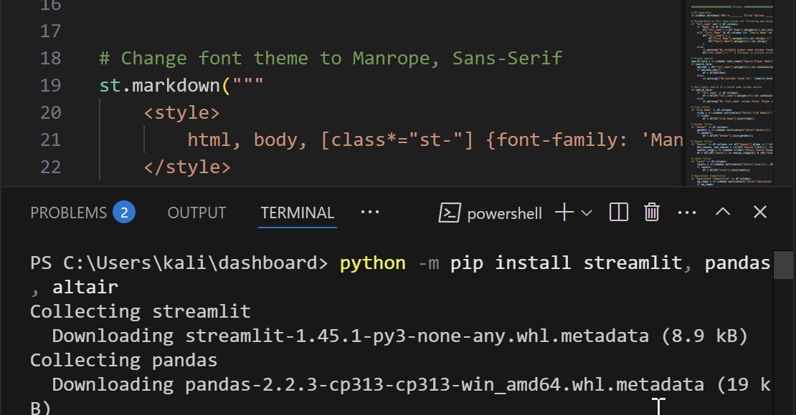
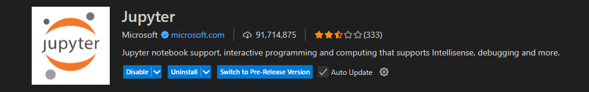

# Data-science-project
Group P000151DSUG

1. Create a GitHub account:
    -  Open the link and follow the instructions to create the account: https://github.com/

2. Install the following on your computer:
- GIT: https://git-scm.com/downloads
    - Select your system (Windows or Mac)
    - Press 'Click here to Download'
    - Once the file has downloaded, open it
    - **FOR WINDOWS USERS: If the Windows protect screen appears, select 'more info' and 'Run anyway'
    - Keep clicking next as seen below, and then install
    
    - Once completed, select 'Finish'and that is complete!

- PYTHON: https://python.org/downloads/
    - Press 'Download Python' 
    - Once downloaded, open the file
    - Tick the 'Add python.exe to PATH, and select 'Install Now'
    [alt text](image-12.png)
    - Once completed, RESTART YOUR COMPUTER

Once your computer has restarted, click the link below to download VS Code:
- VISUAL STUDIO CODE: https://code.visualstudio.com/Download
    - Select your system (Windows or Mac) and click download
    - Once the file has downloaded, open it
    - Ensure 'I accept the agreement' is selected as seen below:
    
    - Continue clicking next, and then 'install'
    - Wait for the install, and select 'Finish', and it will open

3. Install the correct extensions:
    - In VS code, select the cube icon in the tab as seen where the mouse is hovering
    
    - Type 'python' and select install on the first one that appears, and wait for it to install

4. Loading the repository on your laptop
    - Once it's installed, click on the pages icon at the top where the mouse is, and select 'Clone Repository'
    
    - Select 'Clone from GitHub' in the search bar
    - The message 'the extension GitHub wants to sign in using GitHub' will appear, click allow
    - Once it's taken you to the GitHub login, login in using the account you've created and click the green 'Continue' button, and then 'Open Visual Studio Code'
    - The dashboard repository will then appear as an option, select 'Aidentt17/dashboard' 
    
    - Press the 'Select as Repository Destination' button, and click 'Open', then 'Yes I trust the authors'
    - The repository is now loaded onto your machine

5. Setting up packages:
    - Select the three dots in the tool bar, and select 'Terminal' and then 'New Terminal'
    
    - Install the necessary installments in the terminal (copy and paste the below line in the terminal)
            python -m pip install streamlit, pandas, altair
    

6. To run the dashboard:
- Click on dashboard.py file

- Click run (triangle in top right corner)

- In the terminal, paste this line and press enter: streamlit run dashboard.py 

- If it comes up with 'Welcome to Streamlit!', press the enter key again 
- ** FOR WINDOWS USERS: If you get the Window's Security Python pop up, select 'Allow'
- The dashboard should then appear in your browser
videos to help with setup
working with vs(visual studio) code

7. To stop the code:
- Go to Visual Studio Code, and in the terminal, press: crtl + c

FOR NEW DATA: This section is about how to get the excel data into a ready format for our dashboard
1. Install the Jupyter Notebook extensions by going to the extensions box and typing 'Jupyter'

2. With this we can now use the "dataprep.ipynb" file
- Steps to update data
- Delete old data
- Add updated excel document
- Run the dataprep.ipynb file
- All done and good to run dashboard with updated data

TO TURN THE DASHBOARD INTO A WEB-LINK:
- 1,sign into Streamlit Community Cloud (free version) using your GitHub account (press authorise): 
https://authkit.streamlit.io/?client_id=project_01EZ8RPVCZQ40ZGBV6Y87N8V8V&redirect_uri=https%3A%2F%2Flogin.streamlit.io%2Fapi%2Fv1%2Flogin%2Fshare%2Fcallback&response_type=code&state=ZeCp1M6p53PseK1vW35J7EZ55cDDMqAcx4K7GsWt170qAvTlswnvhOZ1kZCi-jCaYhrUUU9Jb5aiUVfA7B1JbSvh7fKVrvqCqx-D4Dy49uprhJHHn1ZctyAlRLJnauqs9mpH6BGGSSmtsBYOLHhf-j0us1XjmZpuYBXtBovmRC1h6GJt0JUln78LczuBYV-MQU_a_W9bjri7GvxyRM0aSHvBBc6Oa0_gEWvTNHzR08m9Ek7_dwpPDoUr0L6XuXKDs85I5m7WTqCSs8lW_3D0kUcIPxpN8X2Kr7c41G_OPOVpJDob6UNi0a6jbA1whjg6DJyPiG0JLWk-rcplszW88LVVI3n_a5zbdVYNYJa6Fs3AhigYGSKaQccvzN7pGy55X3Nl2MZJ71X524zeEmJZWXuJGfV8KEMY37-GtKtebw9aoExwRwHnPBex1oxIRE6vVg5GslTVDbJNsJIu3rwoX7JSoLtz-g4WV2-3TU6_&authorization_session_id=01JVGNGGXQ993FW0YQNP5SGZKW
- 2,press the 'Create app' button in the top right hand corner
- 3,select 'Deploy a public app from GitHub', then 'Deploy now'
- 4,paste the GitHub url into respository (this is the URL link on the home-page of the repository - ensure that it is on public)
- 5,adjust the main file path to 'dashboard.py', and set the App URL
- 6,Press deploy and now it is transformed into a web-based link

videos to help with setup:
working with vs(visual studio) code
https://www.youtube.com/watch?v=B-s71n0dHUk&ab_channel=VisualStudioCode

git/ github in vs code
https://www.youtube.com/watch?v=i_23KUAEtUM&t=300s&ab_channel=VisualStudioCode

